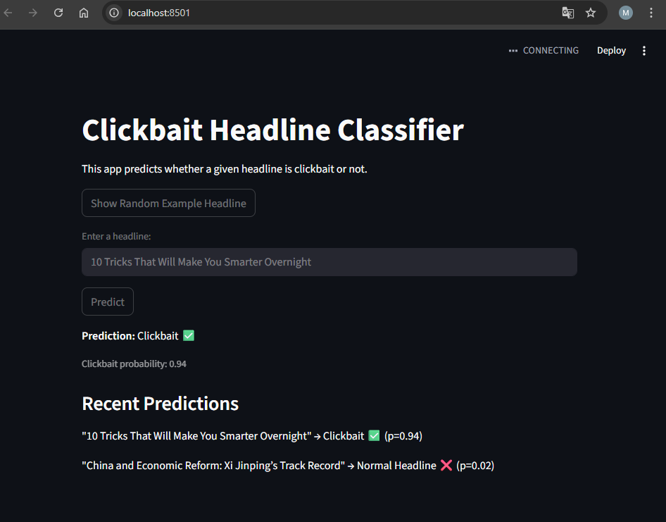

## Örnek Çalışma



# Clickbait Headline Classifier

*Kısa:* Haber başlıklarının clickbait (tıklama tuzağı) olup olmadığını makine öğrenmesiyle tahmin eder.
TF-IDF vektörleştirme + Logistic Regression kullanır. Ayrıca Streamlit ile etkileşimli web arayüzü içerir.


## Gereksinimler

- Python 3.10 veya üzeri (önerilen: 3.11)
- Windows / macOS / Linux
- (Opsiyonel) Sanal ortam (virtualenv) önerilir


## Kurulum (Geliştirici / Kullanıcı)

1. **Depoyu klonla** veya `.zip` olarak indir:

   ```bash
   git clone https://github.com/<kullanici-adin>/clickbait-classifier.git
   cd clickbait-classifier

2. **Sanal ortam oluştur**

    python -m venv .venv
    # Windows:
    .venv\Scripts\activate
    # macOS / Linux:
    source .venv/bin/activate

3. **Gereksinimleri yükle**

    pip install -r requirements.txt


## Kullanım

1. **Veriyi ekle**
    data/ klasörüne clickbait_data.csv dosyasını koy.
    Dosya şu iki sütunu içermelidir:

    headline,clickbait
    "This will blow your mind",1
    "Government announces new tax policy",0 

2. **Modeli eğit**
    python src/train_simple.py

    Bu komut modeli eğitir ve aşağıdaki dosyaları oluşturur:

    models/model.joblib
    models/vectorizer.joblib

3. **Web arayüzünü başlat**
    streamlit run app.py
    Terminalde göreceğin adresi tarayıcıda aç (örnek: http://localhost:8501).


## Dosya Yapısı
```bash
clickbait-classifier/
│
├─ src/
│  └─ train_simple.py      → Eğitim betiği (TF-IDF + Logistic Regression)
│
├─ data/                   → CSV veri dosyaları (repoya dahil edilmez)
├─ models/                 → Kaydedilen model dosyaları
├─ results/                → Çıktılar (rapor, grafik vs.)
│
├─ app.py                  → Streamlit arayüzü
├─ requirements.txt        → Gerekli kütüphaneler
├─ .gitignore
└─ README.md
```

## Model Detayları
    Vectorizer: TF-IDF (max_features=5000, stop_words='english')
    Classifier: Logistic Regression (max_iter=200)
    Metrics: Accuracy, Precision, Recall, F1-score


## Sık Sorunlar
    ModuleNotFoundError: Sanal ortamı aktifleştir ve pip install -r requirements.txt çalıştır.
    UnicodeDecodeError: CSV dosyanı UTF-8 olarak kaydet.
    ValueError(could not convert string to float): headline sütununda boş (NaN) veri olabilir.
    Address already in use: streamlit run app.py --server.port 8502 ile farklı portta çalıştır.
